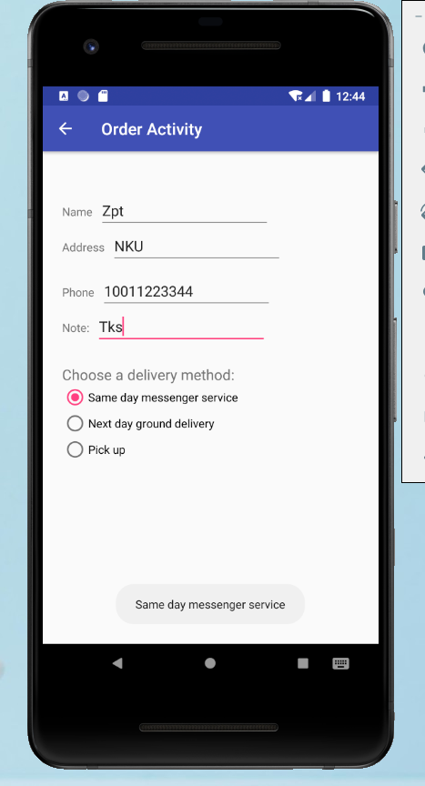
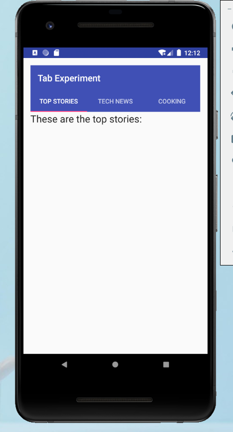
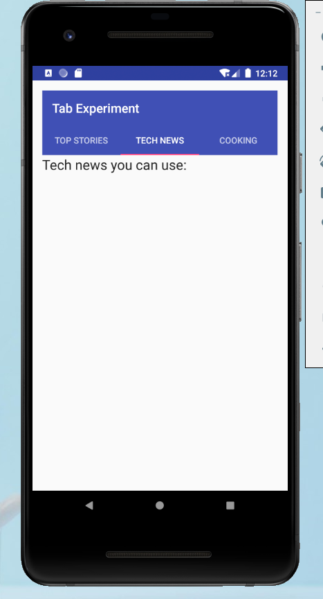
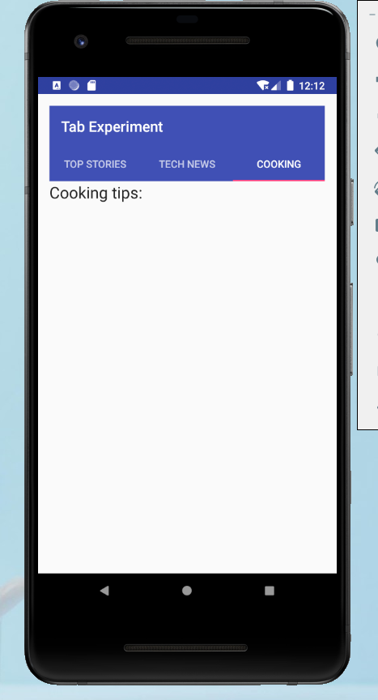
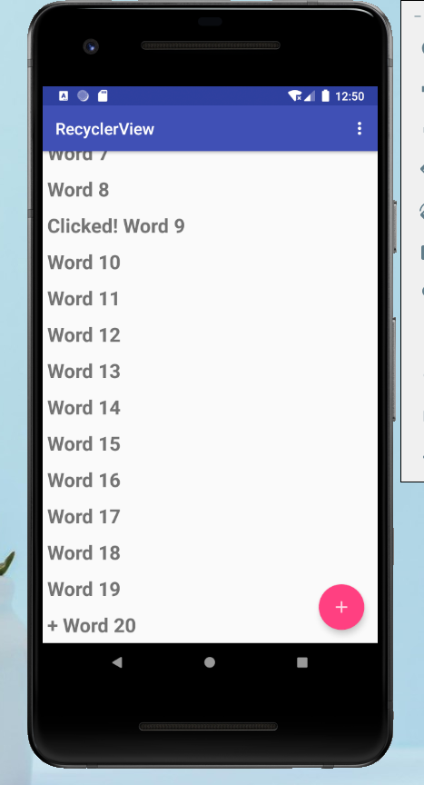
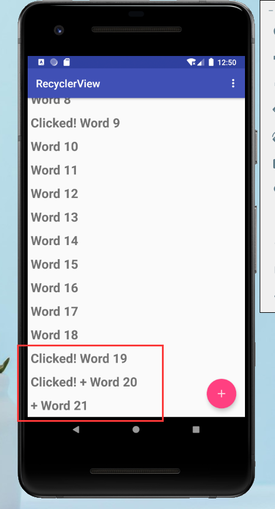

# Lab 7

### Part A

[**项目文件夹**](DroidCafe)

效果图：

[**演示视频**](partA.mp4)

-----

### Part B

[**项目文件夹**](DroidCafe)

效果图：

[**演示视频**](partB.mp4)

-----

### Part C

[**项目文件夹**](DroidCafe)

效果图：

[**演示视频**]([partC.mp4)